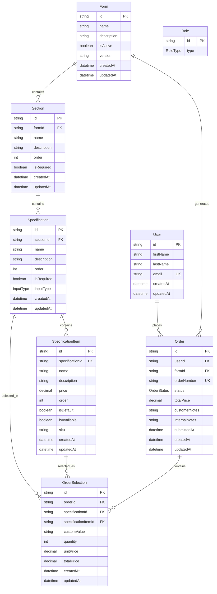

# Caravan Order Form Database Schema

## Entity Relationship Diagram



## Hierarchical Structure Flow

```
📋 Form (Caravan Order Form)
├── 🏗️ Section 1 (e.g., "Exterior Features")
│   ├── ⚙️ Specification 1.1 (e.g., "Body Color")
│   │   ├── 🎨 Item: White
│   │   ├── 🎨 Item: Silver
│   │   └── 🎨 Item: Black
│   ├── ⚙️ Specification 1.2 (e.g., "Awning Type")
│   │   ├── 🏠 Item: Roll-out Awning
│   │   ├── 🏠 Item: Fixed Awning
│   │   └── 🏠 Item: No Awning
│   └── ⚙️ Specification 1.3 (e.g., "Custom Graphics")
│       └── 📝 Text Input Field
├── 🏗️ Section 2 (e.g., "Interior Features")
│   ├── ⚙️ Specification 2.1 (e.g., "Bed Configuration")
│   │   ├── 🛏️ Item: Double Bed
│   │   ├── 🛏️ Item: Twin Beds
│   │   └── 🛏️ Item: Bunk Beds
│   └── ⚙️ Specification 2.2 (e.g., "Kitchen Layout")
│       ├── 🍳 Item: Galley Kitchen
│       ├── 🍳 Item: L-Shaped Kitchen
│       └── 🍳 Item: Compact Kitchen
└── 🏗️ Section 3 (e.g., "Technical Specifications")
    ├── ⚙️ Specification 3.1 (e.g., "Solar Panel")
    │   ├── ⚡ Item: 100W Panel
    │   ├── ⚡ Item: 200W Panel
    │   └── ⚡ Item: No Solar
    └── ⚙️ Specification 3.2 (e.g., "Battery Capacity")
        ├── 🔋 Item: 100Ah Lithium
        ├── 🔋 Item: 200Ah Lithium
        └── 🔋 Item: 300Ah Lithium
```

## Enums

### InputType
- `SINGLE_SELECT` - Radio buttons (select one)
- `MULTIPLE_SELECT` - Checkboxes (select multiple)
- `TEXT_INPUT` - Single line text
- `TEXT_AREA` - Multi-line text
- `NUMBER_INPUT` - Numeric input
- `DATE_INPUT` - Date picker
- `FILE_UPLOAD` - File attachment

### OrderStatus
- `DRAFT` - Customer configuring
- `SUBMITTED` - Customer submitted
- `UNDER_REVIEW` - Staff reviewing
- `APPROVED` - Order approved
- `IN_PRODUCTION` - Being manufactured
- `COMPLETED` - Order finished
- `CANCELLED` - Order cancelled

### RoleType
- `STAFF` - Regular staff member
- `ADMIN` - Administrator

## Data Flow Example

### 1. Form Creation (Admin)
```
Admin creates Form "Hornet Family Caravan 2025"
├── Section: "Exterior" (order: 1)
│   ├── Spec: "Body Color" (SINGLE_SELECT, required)
│   │   ├── Item: "Pearl White" ($0)
│   │   ├── Item: "Metallic Silver" ($500)
│   │   └── Item: "Midnight Black" ($800)
│   └── Spec: "Custom Decals" (TEXT_AREA, optional)
└── Section: "Interior" (order: 2)
    └── Spec: "Bed Type" (SINGLE_SELECT, required)
        ├── Item: "Queen Bed" ($0)
        └── Item: "Twin Beds" ($300)
```

### 2. Customer Order Process
```
Customer selects:
├── Body Color: "Metallic Silver" → OrderSelection
├── Custom Decals: "Family name on side" → OrderSelection
└── Bed Type: "Queen Bed" → OrderSelection

Order Total: $500 (Silver color) + $0 (Queen bed) = $500
```

## Key Features

1. **Flexible Form Builder**: Admins can create any form structure
2. **Dynamic Pricing**: Each item can have its own price
3. **Multiple Input Types**: Support for various input methods
4. **Order Tracking**: Complete order lifecycle management
5. **Validation**: Required fields and business logic
6. **Audit Trail**: Creation and update timestamps
7. **Scalable**: Can handle multiple caravan models/forms

## Use Cases

### For JotForm-like Functionality:
- **Form Builder UI**: Drag-and-drop sections and specifications
- **Dynamic Rendering**: Forms render based on database structure
- **Conditional Logic**: Show/hide specs based on previous selections
- **Real-time Pricing**: Calculate totals as user selects options
- **Order Management**: Track orders through production pipeline
